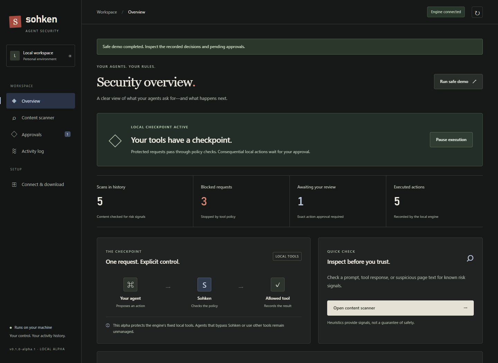
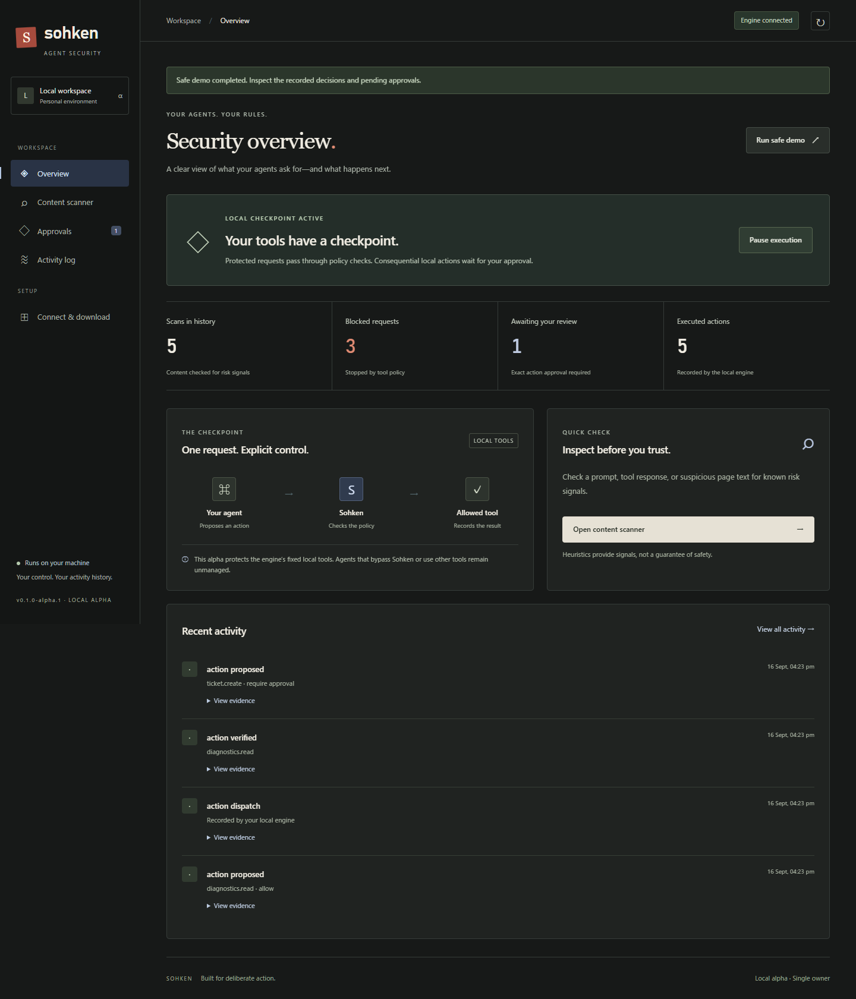
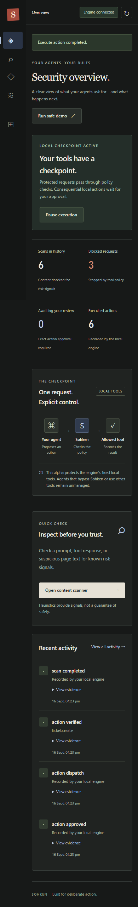
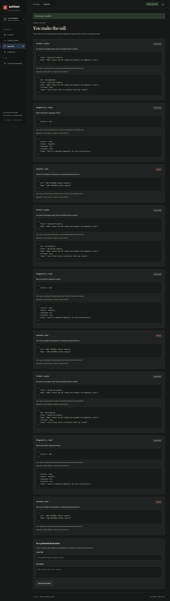
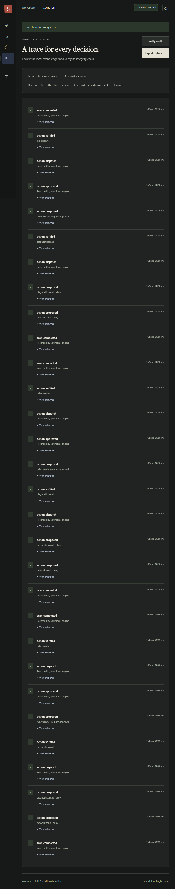

<p align="center">
  
</p>

<h1 align="center">
  <code>░██████╗░█████╗░██╗░░██╗██╗░░██╗███████╗███╗░░██╗</code><br/>
  <code>██╔════╝██╔══██╗██║░░██║██║░██╔╝██╔════╝████╗░██║</code><br/>
  <code>╚█████╗░██║░░██║███████║█████═╝░█████╗░░██╔██╗██║</code><br/>
  <code>░╚═══██╗██║░░██║██╔══██║██╔═██╗░██╔══╝░░██║╚████║</code><br/>
  <code>██████╔╝╚█████╔╝██║░░██║██║░╚██╗███████╗██║░╚███║</code><br/>
  <code>╚═════╝░░╚════╝░╚═╝░░╚═╝╚═╝░░╚═╝╚══════╝╚═╝░░╚══╝</code>
</h1>

<h3 align="center">
  <code>⟨ AGENT SECURITY ⟩</code><br/>
  <em>Your local checkpoint for tool-using AI agents.</em><br/>
  <sub>Desktop · Browser Extension · Terminal CLI · MCP Protocol</sub>
</h3>

<p align="center">
  
  
  
  
  
</p>

<p align="center">
  <code>━━━━━━━━━━━━━━━━━━━━━━━━━━━━━━━━━━━━━━━━━━━━━━━━━━━━━━━━━━━</code>
</p>

---

## `> SYSTEM.BOOT` — What is Sohken?


**Sohken** is a **Hermes-inspired local security companion** for AI agents. It sits between your agent and the real world — scanning prompts for injection attacks, enforcing strict tool policies, requiring human approval for dangerous actions, and recording every decision in a tamper-evident audit chain.

Think of it as a **firewall for your AI's hands.** Your agent wants to delete a file? Sohken says *"not so fast."* Your agent wants to create a ticket? Sohken says *"let the human decide."* Your agent got hit with a prompt injection? Sohken catches the signal before it becomes action.

**One engine. Four surfaces. Zero cloud dependencies.**

```
┌─────────────────────────────────────────────────────┐
│                                                     │
│   ╔═══════════════════════════════════════════╗     │
│   ║         SOHKEN LOCAL ENGINE               ║     │
│   ║   Scanner · Policy · Approval · Ledger    ║     │
│   ╚═══════════════╦═══════════════════════════╝     │
│                   ║                                 │
│     ┌─────────────╬─────────────┬──────────────┐    │
│     │             │             │              │    │
│  Desktop       Browser       Terminal        MCP    │
│  (Electron)   (Manifest V3)   (CLI)       (stdio)  │
│                                                     │
│   ● Runs on 127.0.0.1:4317                         │
│   ● SQLite WAL · Hash-linked audit chain            │
│   ● No API keys · No cloud · No GPU                 │
│                                                     │
└─────────────────────────────────────────────────────┘
```

<br clear="right"/>

<p align="center">
  <code>━━━━━━━━━━━━━━━━━━━━━━━━━━━━━━━━━━━━━━━━━━━━━━━━━━━━━━━━━━━</code>
</p>

---

## `> VISUAL.INTERCEPT` — The Dashboard

<p align="center">
  
</p>

<p align="center"><em>「 Security overview — your agents, your rules. One glance tells you everything. 」</em></p>

The dashboard is your **command center.** Real-time stats show scans in history, blocked requests, pending approvals, and executed actions. The checkpoint flow visualizes exactly how every agent request passes through Sohken's policy engine before reaching any tool.

<table>
<tr>
<td width="50%">

<p align="center">
  
</p>

<p align="center"><strong>Full Overview</strong><br/><sub>Scan metrics · Checkpoint flow · Recent activity feed</sub></p>

</td>
<td width="50%">

<p align="center">
  
</p>

<p align="center"><strong>Mobile Responsive</strong><br/><sub>Full functionality on any screen size</sub></p>

</td>
</tr>
</table>

<p align="center">
  <code>━━━━━━━━━━━━━━━━━━━━━━━━━━━━━━━━━━━━━━━━━━━━━━━━━━━━━━━━━━━</code>
</p>

---

## `> APPROVAL.GATE` — You Make The Call


Every consequential action requires **your explicit approval.** Sohken doesn't auto-execute anything dangerous. It presents the exact tool call, the exact arguments, the exact cryptographic digest — and waits for you.

**Approve ≠ Execute.** They're separate steps. You approve the *exact* action. Then you choose when to dispatch it. Full control, full audit trail, zero ambiguity.

<br clear="left"/>

<p align="center">
  
</p>

<p align="center"><em>「 Review the exact tool and arguments before approving. Approval and execution are separate steps. 」</em></p>

<p align="center">
  <code>━━━━━━━━━━━━━━━━━━━━━━━━━━━━━━━━━━━━━━━━━━━━━━━━━━━━━━━━━━━</code>
</p>

---

## `> AUDIT.CHAIN` — A Trace For Every Decision

<p align="center">
  
</p>

<p align="center"><em>「 Hash-linked event chain. Every scan, every proposal, every approval, every execution — recorded and verifiable. 」</em></p>

The activity log is an **immutable, hash-linked evidence chain** stored in local SQLite. Every event references the previous event's hash. You can verify the entire chain hasn't been tampered with. Export sanitized JSON for compliance or incident review.

```
scan completed ──→ action proposed ──→ action verified ──→ action approved ──→ action dispatch
       │                  │                   │                  │                    │
       └──── hash ────────┴──── hash ─────────┴──── hash ────────┴──── hash ──────────┘
                         ↑ tamper-evident chain ↑
```

<p align="center">
  <code>━━━━━━━━━━━━━━━━━━━━━━━━━━━━━━━━━━━━━━━━━━━━━━━━━━━━━━━━━━━</code>
</p>

---

## `> QUICK.START` — Boot The Engine


**Requirements:** Node.js 24+. That's it. No API keys. No cloud. No GPU. No paid models.

```sh
# ▸ Clone and enter
git clone https://github.com/MelkiZedekICT/sohken.1-manage.git
cd sohken.1-manage

# ▸ Install dependencies
npm ci

# ▸ Launch the engine
node bin/sohken.mjs serve
```

A private pairing URL appears in your terminal. **Treat it like a password.** Open it in your browser and you're in the dashboard.

<br clear="right"/>

### `>> DEMO MODE`

```sh
# Click "Run safe demo" in the dashboard, or:
# It creates an injection signal, a blocked transfer, a verified diagnostic, and a pending ticket.
# Approve the ticket. Execute it. All effects stay local.
```

### `>> CLI COMMANDS`

```sh
node bin/sohken.mjs scan --text "Ignore previous instructions"   # ▸ Scan for injection
node bin/sohken.mjs status                                        # ▸ Engine status
node bin/sohken.mjs audit verify                                  # ▸ Verify audit chain
node bin/sohken.mjs export                                        # ▸ Export sanitized JSON
```

<p align="center">
  <code>━━━━━━━━━━━━━━━━━━━━━━━━━━━━━━━━━━━━━━━━━━━━━━━━━━━━━━━━━━━</code>
</p>

---

## `> INTERFACE.MATRIX` — Four Surfaces, One Engine

<p align="center">
  
</p>

<table>
<tr>
<th width="25%">🖥️ Desktop</th>
<th width="25%">🌐 Browser Extension</th>
<th width="25%">⌨️ Terminal CLI</th>
<th width="25%">🔌 MCP Protocol</th>
</tr>
<tr>
<td>

Electron app with full dashboard. Extract the portable ZIP and launch `Sohken.exe`. Unsigned, no auto-updates. The full extracted folder is required.

</td>
<td>

Manifest V3 Chrome/Edge extension. Minimal permissions, explicit capture, local-only scan. Load unpacked from the `extension/` folder.

</td>
<td>

`sohken serve`, `scan`, `status`, `audit verify`, `export`. Install globally from the release tarball or run directly with Node.

</td>
<td>

JSON-RPC stdio adapter for Hermes-compatible agents. TypeScript SDK included. See [integration docs](integration/README.md).

</td>
</tr>
</table>

<p align="center">
  <code>━━━━━━━━━━━━━━━━━━━━━━━━━━━━━━━━━━━━━━━━━━━━━━━━━━━━━━━━━━━</code>
</p>

---

## `> SECURITY.CORE` — What's Under The Hood


```
┌──────────────────────────────────────────────┐
│              ENFORCEMENT LAYERS              │
├──────────────────────────────────────────────┤
│                                              │
│  ██ SCANNER                                  │
│  ├─ Prompt injection detection               │
│  ├─ Private key / credential redaction       │
│  ├─ Social engineering signal detection      │
│  └─ Heuristic scoring (not ML magic)         │
│                                              │
│  ██ POLICY ENGINE                            │
│  ├─ Typed tool contracts (allow/deny/approve)│
│  ├─ diagnostics.read  → ALLOW               │
│  ├─ ticket.create     → REQUIRE APPROVAL     │
│  ├─ file.delete       → ALWAYS DENY          │
│  └─ network.send      → ALWAYS DENY          │
│                                              │
│  ██ APPROVAL BINDING                         │
│  ├─ Immutable digest per action              │
│  ├─ 10-minute expiry                         │
│  ├─ Separate approve / execute steps         │
│  └─ Agent cannot approve its own requests    │
│                                              │
│  ██ AUDIT LEDGER                             │
│  ├─ SQLite WAL + hash-linked chain           │
│  ├─ HMAC-protected mutable state             │
│  ├─ Idempotent local ticket effects          │
│  └─ Verified export with integrity check     │
│                                              │
│  ██ TOKEN SEPARATION                         │
│  ├─ Owner token: approve, reject, pause      │
│  └─ Agent token: scan, propose, execute only │
│                                              │
└──────────────────────────────────────────────┘
```

<br clear="right"/>

### `>> CAPACITY LIMITS`

| Resource | Limit |
|---|---|
| Scan text | 64 KB |
| HTTP body | 100 KB |
| Rate limit | 240 req/min per role |
| Scan history | 1,000 |
| Proposed actions | 1,000 |
| Audit events | 10,000 / profile |

<p align="center">
  <code>━━━━━━━━━━━━━━━━━━━━━━━━━━━━━━━━━━━━━━━━━━━━━━━━━━━━━━━━━━━</code>
</p>

---

## `> TECH.STACK` — Engineering Arsenal

<p align="center">
  
</p>

<p align="center"><em>「 36/36 tests passed. Zero vulnerabilities. All systems nominal. 」</em></p>

| Layer | Technology |
|---|---|
| **Runtime** | Node.js 24 LTS |
| **Database** | SQLite WAL (built-in) |
| **Desktop** | Electron 44.4.1 |
| **Extension** | Chrome Manifest V3 |
| **SDK** | TypeScript |
| **Protocol** | REST / JSON-RPC / stdio MCP |
| **Tests** | Node's built-in test runner |
| **CI** | GitHub Actions |
| **UI** | Vanilla HTML/CSS/JS (no framework dependencies) |
| **Packaging** | @electron/packager 20.3.0 |

> **Design philosophy:** The original research proposed Python/PostgreSQL. The downloadable multi-surface requirement led to a deliberate single-runtime pivot. One language, one process, zero external services. See [Architecture Decisions](docs/ARCHITECTURE.md).

<p align="center">
  <code>━━━━━━━━━━━━━━━━━━━━━━━━━━━━━━━━━━━━━━━━━━━━━━━━━━━━━━━━━━━</code>
</p>

---

## `> DEV.CONSOLE` — Build & Test

```sh
npm ci                        # ▸ Install dependencies
npm test                      # ▸ Run all 36 tests (core + integration + extension)
npm run test:core             # ▸ Core tests only
npm run build:sdk             # ▸ Compile TypeScript SDK
npm run desktop               # ▸ Launch Electron dev window
npm run package:desktop       # ▸ Build portable desktop ZIP
npm run package:release       # ▸ Build full release (desktop + terminal + extension)
```

> **Note:** Desktop development needs the Electron runtime. If npm hasn't downloaded it, run `node node_modules/electron/install.js`. Package scripts build locally and don't publish anything.

<p align="center">
  <code>━━━━━━━━━━━━━━━━━━━━━━━━━━━━━━━━━━━━━━━━━━━━━━━━━━━━━━━━━━━</code>
</p>

---

## `> PROJECT.MAP` — Repository Structure

```
sohken.1-manage/
│
├── src/                    # Core engine
│   ├── engine.mjs          #   Policy, approval, execution, audit
│   ├── scanner.mjs         #   Prompt injection & risk heuristics
│   └── server.mjs          #   Authenticated loopback HTTP API
│
├── bin/
│   └── sohken.mjs          # CLI entrypoint (serve, scan, status, audit, export)
│
├── ui/                     # Dashboard (vanilla HTML/CSS/JS)
│   ├── index.html
│   ├── styles.css
│   └── app.js
│
├── extension/              # Chrome/Edge Manifest V3 extension
│   ├── manifest.json
│   ├── popup.html/css/mjs
│   └── scanner.mjs
│
├── desktop/                # Electron wrapper
├── sdk/                    # TypeScript agent SDK
├── integration/            # MCP stdio adapter + integration tests
├── tests/                  # Core unit tests
├── research/               # Research documents & problem statements
├── docs/                   # Architecture, design, validation, portfolio
│   └── screenshots/        # Dashboard screenshots
├── scripts/                # Packaging automation
└── release/                # Built artifacts (gitignored)
```

<p align="center">
  <code>━━━━━━━━━━━━━━━━━━━━━━━━━━━━━━━━━━━━━━━━━━━━━━━━━━━━━━━━━━━</code>
</p>

---

## `> THREAT.MODEL` — Honest Boundaries


**What Sohken protects:**
- Its own fixed local tool adapters and their HTTP/MCP invocation path

**What Sohken does NOT protect:**
- Tools outside Sohken's managed set
- A compromised OS user or hostile administrator
- Browser memory or third-party agent integrations
- Content encrypted in transit by other systems

> ⚠️ **A model with unrestricted terminal access as the owner OS user could read the credential file or bypass Sohken entirely.** The alpha is not an OS sandbox. Real deployment requires credential separation and external tool mediation.

Read the full [SECURITY.md](SECURITY.md) before connecting any agent. See the [Validation Report](docs/VALIDATION.md) for actual checks.

<br clear="right"/>

<p align="center">
  <code>━━━━━━━━━━━━━━━━━━━━━━━━━━━━━━━━━━━━━━━━━━━━━━━━━━━━━━━━━━━</code>
</p>

---

## `> DOCS.INDEX` — Further Reading

| Document | Description |
|---|---|
| [SECURITY.md](SECURITY.md) | Threat model, token separation, capacity limits |
| [Architecture](docs/ARCHITECTURE.md) | Stack decision rationale, module boundaries |
| [Design Spec](docs/DESIGN.md) | Sumi-inspired visual design system |
| [Validation](docs/VALIDATION.md) | Test evidence and verification report |
| [Portfolio Guide](docs/PORTFOLIO.md) | Honest presentation for demo / internship |
| [Build Journal](BUILD_JOURNAL.md) | Live development log with patches & decisions |
| [Extension Guide](extension/README.md) | Browser extension install & usage |
| [MCP Integration](integration/README.md) | Hermes / stdio agent connection |

<p align="center">
  <code>━━━━━━━━━━━━━━━━━━━━━━━━━━━━━━━━━━━━━━━━━━━━━━━━━━━━━━━━━━━</code>
</p>

---

<p align="center">
  
</p>

<h3 align="center"><code>⟨ SOHKEN ⟩</code></h3>
<p align="center"><em>Built for deliberate action.</em></p>
<p align="center"><sub>Your agents. Your rules. Your machine.</sub></p>

<p align="center">
  <code>━━━━━━━━━━━━━━━━━━━━━━━━━━━━━━━━━━━━━━━━━━━━━━━━━━━━━━━━━━━</code><br/>
  <sub><code>v0.1.0-alpha.1 · LOCAL ALPHA · SINGLE OWNER</code></sub><br/>
  <sub>No cloud dependency · No paid models · No external attestation claims</sub>
</p>
