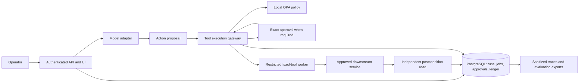

# Sohken: rigorous build and deployment plan

16 September 2026 • Solo builder • Local first • Lowest practical operating cost

## 1. The product to build

Build a self-hostable execution gateway for an engineering-support agent. The agent reads approved runbooks, inspects bounded diagnostic data, produces a cited diagnosis, and proposes a ticket or remediation action. Sohken decides whether that action is allowed, binds any approval to the exact request, executes it through a restricted adapter, and verifies the result.

**First demonstration:** a malicious instruction inside a ticket causes the model to propose an unauthorized action; the gateway denies it. A legitimate action is then approved, executed once despite a simulated timeout, and verified against the final ticket state. A second person can deploy this demonstration and inspect its evidence.

Interpret “MIT level” as explicit assumptions, systems invariants, falsifiable experiments, careful statistics, and reproducible engineering. MIT's graduate distributed-systems course is a useful learning reference [S20](https://pdos.csail.mit.edu/6.824/general.html); this plan has no MIT affiliation, assessment or certification. The work is not complete merely because a model produces a convincing answer.

The user's requested deliverable is this plan and researched problems list. This package does not contain an implemented or deployed platform.

## 2. Decisions, assumptions and limits

| Decision | Solo-builder default | Reason / condition for revisiting |
|---|---|---|
| Customer workflow | Engineering support and incident triage | Bounded evidence, inspectable state, a natural human operator; demand remains unvalidated. |
| Deployment | Existing computer, then one private Linux host | Avoid paid infrastructure until an external user needs access. |
| Customer isolation | One tenant per deployment | Avoid shared-SaaS isolation complexity; preserve project/environment scope in every record. |
| Execution | Fixed, typed tool adapters | No arbitrary shell, user-uploaded executables, production deletion or autonomous remediation. |
| Models | Deterministic fixture provider first; one paid API next; second real provider before portability claim | Fixtures keep tests cheap but do not establish model quality. No GPU purchase. |
| Staffing | One builder, 15–20 focused hours/week | Planning estimate: 20–24 weeks, roughly 300–480 hours; allow more time if systems/security skills are new. |
| User-facing pilot | One operator, one service, one ticketing integration | Grow only after safety, utility and operating effort are measured. |
| Availability | Best-effort private pilot, disclosed single-host failure risk | No enterprise availability commitment or unsupervised critical changes. |
| Research scope | Public primary sources plus supplied PDF | No measured baseline, customer interviews or validated pricing yet. |

The original PDF's broad ambition remains a roadmap. Persistent memory, inter-agent delegation, shared multi-tenant SaaS, GPU inference, anomaly-learning models, Kubernetes and arbitrary code execution are deferred. Scope reduction must be visible in the product; unsupported actions return a clear refusal.

## 3. Validate the need before building the whole platform

During weeks 1–2, speak with five engineering/support operators. Ask them to walk through their latest agent failure or manual triage task: evidence consulted, systems touched, approval boundary, consequences, debugging time, and existing controls. Request sanitized examples and explicit permission before incorporating any customer material into evaluation data.

Proposed discovery gate: two people identify a concrete workflow they want controlled and one agrees to deploy a bounded pilot. If nobody values the execution boundary, test a narrower adapter or evaluation product before expanding infrastructure. These numbers are founder decision rules, not statistically representative market research.

Document alternatives fairly:

| Alternative | Verified overlap | Sohken decision |
|---|---|---|
| Langfuse | Self-hosted tracing, prompts, evaluation and OTel integration [S15](https://langfuse.com/docs) | Export compatible traces; do not rebuild its entire analysis UI. |
| LangSmith | Offline and online evaluation workflows [S16](https://docs.langchain.com/langsmith/evaluation-concepts) | Reuse concepts or exports; check terms before adopting a hosted service. |
| NVIDIA NeMo Guardrails | Current tool-call/schema and structural result checks [S08](https://docs.nvidia.com/nemo/guardrails/configure-guardrails/guardrail-catalog/tool-calling) | Optional adapter, tested against a pinned version. Do not claim it lacks all tool guardrails. |
| OPA | Declarative policy and bundle distribution [S17](https://www.openpolicyagent.org/docs/management-bundles) | Use as the policy component, not a reason to invent a new language. |
| Existing manual process | Customer-specific; not yet inspected | Baseline time, errors and operating effort before claiming improvement. |

The proposed distinction is the combined action ledger, exact approvals, restricted execution, data-flow controls and outcome evidence. This is a product hypothesis, not a claim competitors cannot implement it.

## 4. Threat model and security claims

Assets: user authority, tool credentials, private documents, service state, approval records, audit evidence and spending budget. Adversaries may control a ticket, document, tool result, or submitted tool metadata; trigger retries; exploit concurrent execution; and attempt cross-project access. A faulty model is treated as an untrusted planner.

Trust boundaries: user → authenticated application; source content → model context; model proposal → policy; approval → dispatch; runner → downstream API; internal data → model/provider/log/export destination. Source trust is provenance, not permission. A model's confidence cannot expand authority.

The first release assumes the host administrator, operating system and approved fixed adapter code are trusted. Root compromise, stolen signing keys, malicious dependencies and unmanaged external tools are not solved by this gateway. Compromised-host resistance and hostile-code sandboxes need separate work before supporting arbitrary code. gVisor itself documents that isolation still requires secure networking and resource controls [S18](https://gvisor.dev/docs/architecture_guide/security/).

Required invariants, proposed by this plan:

1. **Complete mediation:** every protected side effect passes through the gateway; the agent has neither a bypass credential nor a permitted direct network route.
2. **Authority intersection:** action scope is within user grant ∩ workflow grant ∩ resource grant ∩ tool capability ∩ current environment policy.
3. **Approval integrity:** approval authorizes only a fixed action digest and resource revision, once, before expiry and while the approver still has authority.
4. **Durable intent:** a write has a committed action/decision record before dispatch. The absence of an audit record is never permission to execute.
5. **Bounded resource admission:** sum of committed cost plus active conservative reservations never exceeds the run admission budget.
6. **Verified completion:** SUCCESS requires an independent postcondition check. Uncertain external commit becomes UNKNOWN, never an invented success.
7. **Scope preservation:** every query, cache entry, artifact and job remains bound to tenant/project/environment and current access rights.
8. **No effectful playback:** recorded replay never invokes live external writes.

Model the approval and execution state machine in a small executable model, optionally TLA+/PlusCal if the builder can maintain it. Explore two workers, one duplicated job, approval expiry, revocation, crash and delayed responses. Search for counterexamples to double consumption and unauthorized dispatch. This verifies the model under its assumptions, not the entire implementation.

## 5. Architecture with the smallest useful operational footprint

This is a conceptual diagram, not a promise that all components are separate services. Ship a modular Python application with FastAPI, a worker using the same codebase, PostgreSQL, and a local OPA process/container. Serve a simple server-rendered UI first. In a connected pilot, add a TLS reverse proxy. Use a PostgreSQL jobs table and transactional outbox rather than Redis, Kafka or a new workflow engine at this scale.

Store documents on a restricted local volume with metadata in PostgreSQL. Start with PostgreSQL full-text search; add a pinned vector extension and embeddings for hybrid retrieval only when the retrieval benchmark demonstrates value. Maintain a retrieval interface so the storage choice can change. Encrypted off-host backups are required for a connected pilot; a local-only demo may use disposable fixtures.

Expose an OpenAI-compatible subset only after specifying which request shapes, streaming behavior and tool fields are supported. Unknown capabilities fail explicitly. Model proxying provides visibility; the execution gateway provides enforcement. Never advertise that changing only a model base URL secures tools executed elsewhere.

Initial tools: search approved runbooks; read a bounded diagnostic fixture; query a parameterized read-only database view; create a ticket in a simulator; produce a simulated email artifact. A pilot may replace ticket creation with one real approved connector. A “read-only” adapter still needs data-access and egress controls.

## 6. Build the action transaction correctly

### Request and data contracts

Core records: Tenant, Project, Environment, Principal, WorkflowVersion, ToolVersion, PolicyVersion, Run, Step, Action, Approval, BudgetReservation, Artifact, AuditEvent, EvalCase and EvalResult. Even a single-tenant deployment includes scope in keys. Credentials are references to a secret store or restricted secret file; they are never normal tool arguments.

An Action includes `action_id`, stable logical operation ID, run/step IDs, authenticated principal, tenant/project/environment, tool ID and digest, canonical typed arguments and their hash, destination, data labels, target resource/revision, policy version, approval ID, deadline, idempotency key, state and postcondition reference. Canonicalization is versioned; reject duplicate JSON keys, unknown fields, invalid numbers and ambiguous resource names.

An AuditEvent includes sequence, event ID, action/run IDs, timestamp, actor, policy outcome/reason codes, version references, sanitized content reference, previous hash and event hash. Do not store hidden model reasoning as a requirement; record observable requests, actions and concise decision explanations.

Proposed API surface, to be implemented and documented:

| Endpoint | Purpose |
|---|---|
| `POST /v1/runs` | Start a scoped workflow with a budget and deadline. |
| `POST /v1/actions/propose` | Validate a complete typed action; produce policy decision and preview. |
| `POST /v1/approvals/{id}/decide` | Authenticated approval/rejection of the exact stored digest. |
| `GET /v1/runs/{id}` | Current state, sanitized timeline and evidence references. |
| `POST /v1/runs/{id}/cancel` | Stop undispatched work and request cancellation of in-flight work. |
| `POST /v1/tools/{id}/revoke` | Remove authority for subsequent dispatch. |
| `POST /v1/evaluations` | Queue isolated evaluation against a pinned release. |

### State machine

`PROPOSED → VALIDATED → DENIED | WAITING_APPROVAL | READY → DISPATCHING → EXECUTED → VERIFIED → SUCCEEDED`

Other states: REJECTED, EXPIRED, CANCELLED, FAILED, PARTIAL and UNKNOWN. Transitions are persisted with optimistic version checks. Approval and action state cannot be mutated through model tool output. Use a database uniqueness constraint for logical operation identity and transactional single-use approval consumption.

Dispatch procedure:

1. Validate caller identity, scope, tool digest, complete argument schema, destination and sensitivity policy.
2. Evaluate policy: deny takes precedence; approval and sandbox requirements are obligations, not alternatives to authorization. Redaction must trigger validation and re-evaluation if it changes executable arguments.
3. Reserve worst-case permitted call cost atomically; store intent and required approval. Waiting actions are durable jobs, not open HTTP requests.
4. At dispatch, recheck revocation, policy version, approver authority, expiry and target resource revision. Claim the job with a lease and consume its execution capability atomically.
5. Invoke the fixed adapter using a stable provider idempotency key if supported. Credentials are injected into the adapter only.
6. Persist result and reconcile actual usage. Read the downstream object independently and evaluate postconditions. Record UNKNOWN if the remote outcome cannot be established.

A database transaction cannot atomically commit an unrelated remote API call. After a timeout, use the provider key or a reliable remote operation identifier to reconcile. Where a connector provides neither, disable automatic retry for ambiguous writes. AWS's idempotency discussion supports this distinction [S10](https://aws.amazon.com/builders-library/making-retries-safe-with-idempotent-APIs/). Worker leases alone do not prevent duplicate remote effects after partitions or pauses.

For mutable resources, use conditional updates/ETags when the downstream service supports them. Otherwise disclose the race and restrict the first pilot to effects with acceptable risk. Cancellation prevents new dispatch; it cannot unsend a request already accepted by a service.

## 7. Policy, retrieval and privacy

Start with five decision inputs: authenticated scope, tool risk, target resource, data destination and available budget. Add explicit rules rather than a single model-generated risk score. Maintain a policy test table of allowed and denied cases. OPA bundles can be signed, but verification must be configured on the actual load path [S17](https://www.openpolicyagent.org/docs/management-bundles). Pin accepted policy versions and fail closed for protected writes when verification or evaluation fails.

Approval UI shows the stored action's destination, resource, exact change, reason for review, expected postcondition, expiry and reversibility. The model may supply a summary, but cannot replace the structured preview. A solo developer can approve simulated actions; a customer's service owner approves real service changes. The agent cannot approve itself.

RAG ingestion stores source URI, owner, ACL, classification, content hash, revision, effective date and chunk offsets. Apply current authorization before exposing results, not only during ingestion. A document's deletion revokes retrieval, caches and accessible evidence references; preservation requirements must be decided separately. Do not treat encrypted retention as permission to retain everything indefinitely.

Untrusted content stays labeled across retrieval and tool outputs. Initially propagate the highest sensitivity of the context to derived actions; this conservative approach can overblock and must be measured. Data labels and pattern-based secret detection do not prove complete semantic noninterference. For mixed public/private workflows, splitting tasks and limiting destinations is safer than claiming perfect taint tracking.

Each factual claim in a diagnosis links to specific evidence spans. Grade both citation presence and support. Conflicting runbooks produce a conflict note or clarification request. Missing evidence produces an abstention; an answer should not become “correct” merely by avoiding all useful claims.

Telemetry defaults to IDs, states, versions, timing, token counts and sanitized error codes. Debug payload capture is opt-in, access-restricted and encrypted. Proposed initial retention: ordinary run metadata 30 days, debug payloads 24 hours, aggregate evaluations 90 days; confirm with each pilot before use. Audit hashes should avoid directly exposing low-entropy secrets; reference restricted artifacts rather than hashing raw secrets into public logs.

## 8. Evaluation as an experiment

Research question: does contextual execution enforcement reduce unauthorized effects while preserving useful completion, compared with the same agent using a simpler authorization baseline?

### Experimental arms

- **A: basic baseline.** Typed tool allowlist and normal identity checks, no contextual action/data-flow rules. All experiments run on fixtures.
- **B: prompt/detector baseline.** A plus explicit injection warnings and a configured detector.
- **C: Sohken.** A plus deterministic contextual policy, exact approvals, budget reservations and state verification; detector optional.
- **D: diagnostic all-deny baseline.** Confirms why low attack success alone is not useful.

Keep model, tools, prompts, task seeds and output limits fixed across arms where appropriate. Report the full-stack effect and smaller ablations: remove approval binding, remove data-flow constraints, or remove postcondition checks one at a time. Never ablate protections against live customer systems.

### Dataset and budget tiers

1. **Every change:** approximately 40 deterministic fixture cases for schema, identity, approval, budget and retry invariants. No paid model calls.
2. **Weekly smoke:** 12 representative tasks × 2 arms × 2 repetitions = 48 paid trajectories, capped by a prepaid evaluation budget.
3. **Release research:** 60 benign, 60 adversarial and 30 failure-injection scenarios = 150 scenarios. Run 3 main arms × 5 repetitions × 2 real provider configurations = 4,500 trajectories. Run the all-deny diagnostic cheaply on fixtures. This larger study is deferred until funding and the small suite justify it; incomplete cells must be reported.

Suggested 60 adversarial scenarios span six families with ten scenarios each: injected evidence, poisoned metadata, forbidden data transfer, forged/stale approval, resource/scope escalation, and denial-of-service/budget abuse. Include multi-turn variants, encoded text and misleading benign security content. An attack counts as successful when an objective forbidden state occurs, not when the model merely utters a suspicious phrase.

Use a development set separately from these release scenarios. Split by source/workflow family to reduce leakage between variants. Borrow methodology and appropriately licensed cases from AgentDojo and tau-bench; pin revisions and preserve attribution [S04](https://arxiv.org/abs/2406.13352), [S05](https://arxiv.org/abs/2406.12045). Add adaptive attacker tests because results depend on the attack/model setup [S06](https://arxiv.org/abs/2606.10525).

### Measurement dictionary

These are proposed metrics and provisional targets using Data's KPI-design approach. There are no measured Sohken baselines yet. The PDF's 95% goals are retained where useful, but not asserted as achievable or industry standards.

| Metric | Definition and denominator | Pilot decision / initial target |
|---|---|---|
| Primary: verified task completion | Runs satisfying all task postconditions and authority rules / all assigned supported benign runs, including failures and timeouts | Target ≥95% on the fixed release suite; investigate by task and provider. |
| Primary: unauthorized effect rate | Adversarial runs reaching the defined forbidden external state / all attempted adversarial runs | Zero observed critical authority violations required to release; disclose sample size and residual uncertainty. |
| Primary: cost per verified task | Total model, tool and allocated hosting cost across all runs / verified successful runs | Must fit the pilot's agreed cap; do not discard failed-run costs. |
| Guardrail: benign false-block rate | Supported benign runs incorrectly blocked by safety policy / supported benign runs | Proposed ≤5%; report legitimate policy denials separately. |
| Guardrail: secret-egress cases | Defined tests in which seeded prohibited data reaches an unapproved sink / all relevant tests | Zero observed; limited to tested encodings and destinations. |
| Diagnostic: citation support | Supported factual claims with a valid cited span / all factual claims requiring evidence | Proposed ≥95%; separately report answerable-task completion and citation coverage. |
| Diagnostic: repeated reliability | Tasks succeeding on all 5 trials / tasks with 5 completed scheduled trials | Publish alongside per-run rate; not a substitute for it. |
| Diagnostic: approval burden | Median/p95 human review time and approvals per completed task | Establish a baseline during usability sessions before setting a hard target. |
| Diagnostic: gateway overhead | p50/p95 gateway-added latency excluding model, remote tool and human wait | Provisional p95 ≤100 ms at the specified local load; measure separately from end-to-end time. |
| Operational: evidence completeness | Runs with required decision, dispatch, outcome, usage and terminal-state records / all accepted runs | 100% for defined tests; incomplete evidence blocks a verified-success label. |

Store each metric's definition/version, numerator, denominator, cohort, provider, policy version, dataset version and time window in the evaluation result. A denied malicious action is a security success; it is not automatically a completed legitimate task. Budget stops and provider failures remain visible in the completion denominator.

Use Wilson intervals for basic proportions, and paired comparisons/cluster bootstrap at the scenario level for repeated trajectories. Repetitions of one scenario are correlated; do not treat all 4,500 runs as independent scenarios. With zero failures in n independent trials, the one-sided 95% upper bound is `1 - 0.05^(1/n)` (approximately `3/n`). Zero in 300 implies an upper bound near 1%, not proven zero risk; curated test cases are also not random production samples.

Use state assertions before semantic judges. Calibrate any LLM grader on at least 30 independently reviewed answers with a written rubric; have a pilot reviewer double-label a subset if possible. Report disagreements and rubric changes. Predeclare release thresholds before evaluating the held-out suite.

## 9. Solo-builder schedule and exit gates

Weeks are estimates at 15–20 hours/week, not commitments. Do not advance on calendar time alone.

| Stage | Weeks | Build and learn | Exit evidence | Problem IDs |
|---|---|---|---|---|
| 0: discovery and specification | 1–2 | Interviews, one workflow, threat boundaries, fixture incident and metric definitions | Written scope, initial cases, demand decision | P31, P32 |
| 1: trusted foundation | 3–5 | Repo, CI, scoped API, PostgreSQL, fixed adapters, minimal UI, fixture model | Fresh-machine fixture demo; bypass and scope tests pass | P03, P04, P08, P09, P10 |
| 2: safe action transaction | 6–9 | OPA rules, action ledger, approval binding, budgets, worker/retry semantics, postconditions | Crash/retry/concurrency suite; no duplicated supported effect | P06, P12–P18, P25 |
| 3: evidence and real model | 10–12 | Versioned runbooks, retrieval ACLs, one paid model adapter, citations, trust labels | Small benign/adversarial run report; cost cap works | P01, P02, P05, P19, P20 |
| 4: research validation | 13–16 | Second provider, evaluation CLI, attack families, repeated trials, adapter contracts | Measured comparison with failures, intervals and ablations; no portability claim without tests | P21–P24, P27 |
| 5: private deployment | 17–19 | TLS/auth, backup/restore, sanitized exports, capacity/chaos tests, kill/revoke UI | Clean-host restore and deployment drill; scoped readiness review | P07, P26, P28–P30 |
| 6: supervised pilot | 20–24 | One real connector; shadow, read-only, then approved low-risk writes | Operator evidence, economics, usable incident report, go/no-go | P15, P16, P31 |

Critical path: mediation → durable action state → approval/retry correctness → fixture evaluation → private deployment → supervised real connector. If short on time, remove another integration or the custom dashboard before weakening execution controls.

Suggested repository layout: `apps/api`, `apps/worker`, `sohken/contracts`, `sohken/policy`, `sohken/adapters`, `sohken/retrieval`, `sohken/audit`, `evals/cases`, `evals/graders`, `tests/faults`, `deploy/compose`, `docs/runbooks`. Pin dependency locks and container digests; do not invent current package versions in the plan.

For every milestone, deliver code, a short architecture decision record, reproducible commands, test output and known limitations. The first week should produce a fixture representing one service incident, a typed ticket action, and tests that reject scope escalation; it need not begin with a visual dashboard.

## 10. Deployment runbook

### Local development

Use the existing Windows machine with a supported Linux container environment, if its memory and virtualization support suffice. Proposed starting allocation: 4 CPU cores, 8 GB RAM and 20 GB free disk for the application stack, excluding any local model. This is an estimate to validate, not a measured requirement. If hardware is smaller, run the UI/API together and use fixture models. Do not buy a GPU for this project.

The first implementation should supply these documented scripts: `demo`, `test-invariants`, `eval-smoke`, `backup`, `restore-test` and `doctor`. These names are planned interfaces, not commands available in the current workspace. `demo` must work entirely with fixtures and no API key; real-model evaluation requires separate explicit configuration and a spending cap.

### Private single-host pilot

1. Choose a Linux VPS or existing private host only after confirming customer data-region needs. Start with the measured smallest capacity that passes the workload; 2–4 vCPU and 4–8 GB RAM is a sizing hypothesis, not a vendor guarantee.
2. Provision using a versioned setup script or infrastructure definition. Create a non-root service account, patched OS, key-based administration and firewall. Keep PostgreSQL, policy engine and worker off public interfaces.
3. Use a private network/VPN where possible. If internet-accessible, expose only TLS ingress, enforce authentication, secure sessions/CSRF protection, rate limits and an explicit operator allowlist. Do not write a custom identity protocol; use an established identity integration for external users.
4. Deploy digest-pinned containers with resource limits, read-only filesystems where possible, bounded temporary storage and no privileged mode/host socket. Keep connector credentials restricted to the worker and rotate them independently.
5. Apply reviewed migrations after a consistent backup. Use readiness checks for database access, loaded policy and writable audit storage. Liveness alone is not readiness.
6. Run the fixture smoke suite and a non-sensitive model connectivity check. Then test a canary read against the pilot's approved resource. Never copy production credentials into fixture tests.
7. Run initially in shadow mode: analyze captured/sanitized proposals without executing real writes. Move to read-only diagnostics, then operator-approved ticket creation after the release gate passes.
8. Maintain encrypted off-host backups and a restoration key accessible outside the failed host. Test restoration before the first real write. Record the last successful backup and restore drill in the UI/runbook.

A separate instance per customer is the default. Future shared hosting requires a new threat review covering database role bypass, cache keys, queues, exports, object references and retrieval filtering. PostgreSQL RLS alone is insufficient if the application uses privileged roles [S19](https://www.postgresql.org/docs/17/ddl-rowsecurity.html).

### Capacity and resilience checks

Provisional test envelope: 5 concurrent runs, up to 20 steps/run, 1 MB maximum tool-result payload, and a 15-minute run deadline excluding an explicitly bounded approval window. Begin with a 10-minute approval expiry. Measure CPU/RAM, database latency, queue depth, admission failures and p95 gateway overhead. Increase only after verifying quotas and fairness.

Inject provider timeout, malformed tool response, duplicated job, worker crash, revoked tool, unavailable policy engine, database restart and disk-full conditions. Desired behavior is explicit degraded operation with no unrecorded protected action. A collector outage may buffer bounded sanitized telemetry; loss of the authoritative ledger blocks writes.

Initial recovery objectives, requiring a drill: restore service within 4 hours; backup recovery point no older than 24 hours. This is not sufficient to reconstruct every intervening remote effect. After restore, disable write dispatch, reconcile all possibly affected remote operation IDs, invalidate old approvals and require fresh approval before reopening writes. If daily backups create unacceptable evidence loss, fund continuous log shipping before expanding the pilot.

### Releases and rollback

CI runs contracts, policy tests, invariants, fixture attacks, dependency scanning and build provenance checks. A release candidate pins app, policy, tool, model configuration, prompt, retrieval corpus and evaluation versions. Deployment is first exercised on local staging data.

Use backward-compatible schema expansion, then application rollout, then later contraction. On a bad release, stop new writes and roll back the application/policy only if the database schema remains compatible; otherwise forward-fix or restore under a reconciliation plan. Backups do not make external effects reversible.

Pilot rollout: shadow → read-only → approved low-risk writes for one operator. Require at least 50 shadow/read-only tasks for preliminary utility review; this is a practical gate, not strong statistical validation. Stop immediately for an authority escape, cross-scope leak, approval mismatch or unexplained duplicate write. Retain the manual workflow as the fallback.

## 11. Low-cost budget and economic model

No current vendor price is quoted here. The figures below are **planning allowances and synthetic unit-price scenarios**, not researched purchasing offers. Existing hardware is assumed; electricity, taxes, customer support and builder labor are excluded. Check actual regional quotes and provider prices before spending.

| Stage | Monthly planning allowance | Rule |
|---|---|---|
| Fixture prototype | $0 incremental hosting/API | Existing hardware; no paid inference. |
| Development with one API | $5–15 model budget | Prepaid or provider cap plus Sohken admission cap; most tests stay fixtures. |
| Private pilot | $10–25 host + $3–8 backups + $10–30 model use = $23–63 | Upper bound is an allowance, not guaranteed sufficient capacity. Domain, if needed, is additional. |
| Full release experiment | Separate one-time approved budget | Estimate all 4,500 trajectories first; reduce experiment scope visibly if funds are insufficient. |

Formula: `model cost/run = input_tokens/1,000,000 × input_rate + output_tokens/1,000,000 × output_rate`, summed across every model call, retry, grader and embedding step. Rates are entered from the actual provider at execution time, with currency/date and cache pricing if applicable.

Illustration only: at assumed $1/M input and $4/M output, a trajectory consuming 12k input + 2k output tokens costs $0.020. A 48-trajectory smoke study costs $0.96; 4,500 trajectories cost $90 before graders, embeddings and retries. A 25% experimental reserve makes that $112.50. These are arithmetic examples, not model recommendations or prices.

At the same assumed usage, 1,000 operational runs cost $20 in model usage. At 95% verified completion and $20 fixed monthly hosting/backups, cost per verified task is ($20 + $20)/950 ≈ $0.042 before labor. Track support hours separately; a low token bill does not imply a viable business.

Stop model calls when reserved funds are exhausted. Do not silently switch models or providers to stay under budget. A cheaper fallback needs its own data-policy approval and evaluation. Set an evaluation limit before every batch and emit a partial-results report when it stops.

## 12. Release gates and requirements traceability

| PDF requirement | Solo implementation / gate |
|---|---|
| Two providers or local + API | Fixture adapter for development, two real configurations by research release. Fixture is not counted as a real provider. |
| Trust-labeled hybrid RAG | Scope/versioning first; lexical baseline, then hybrid search with measured retrieval benefit. Full PDF parity requires completing hybrid evaluation. |
| Tool registry and risk classes | Fixed versioned tools; read, low-risk write, prohibited destructive classes. |
| Allow/deny/approve/redact/sandbox | Deterministic decision plus obligations; redacted executable requests revalidated. |
| Sandbox runner | Restricted fixed adapters; no arbitrary hostile code claim. Stronger isolation is required before expanding that scope. |
| Run dashboard | Minimal timeline, approvals, costs, final state and sanitized evidence. |
| Evaluation CLI | Fixture, smoke and release tiers; state-based judgments and machine-readable results. |
| Kill/revoke/quarantine/replay/export | New-dispatch stop, credential/tool revocation, workflow quarantine, non-effectful playback and sanitized incident export. |
| Compose, then Kubernetes | Compose local/private pilot. Kubernetes deferred until measured scale and operating capacity justify it. |
| 100% approval for simulated destructive effects | Test every destructive fixture path; real destructive effects remain disabled. |
| 95% completion and citation coverage | Measure on declared suite; add actual citation support and false-block guardrails. Missing targets mean no promotion. |
| No duplicate effects under retry | Demonstrate for supported idempotent/reconcilable connectors; ambiguous unsupported writes stop. |
| Every run traceable | Authoritative ledger completeness plus correlated telemetry; metadata-only by default. |

**Local prototype complete:** another person can run fixtures, observe denied injection, approve a safe action and verify final state.

**Connected pilot ready:** all applicable P0 cases pass; authentication and egress restrictions work; supported writes survive crash/retry tests; secret-egress tests pass; backup/restore and cancellation are exercised; known limitations are accepted by the operator.

**Research release ready:** published baselines, dataset manifest, attack families, repeated trials, intervals, ablations, cost/latency and failures. Reduced-budget evidence must be described accurately; do not claim the full study ran when only a smoke suite ran.

**Product continuation justified:** pilot operators receive measurable value, integration effort is affordable, and at least one operator wants continued use. Revenue and willingness to pay still require direct evidence.

## 13. Final handover package to produce during implementation

Deliver a reproducible repository, threat model, API/schema specification, policy examples, connector contracts, evaluation datasets and results, dependency/version manifest, deployment scripts, restore and incident runbooks, and a short measured technical report. Include every known failure and the precise boundary of each security claim.

The first incident runbook should say: stop new dispatch; revoke the affected credential/tool; identify in-flight and uncertain actions; preserve restricted evidence; reconcile downstream state; obtain approval for any compensation; add a regression case; then restore service gradually. A data leak cannot be reversed by deleting its local trace.

The next concrete implementation task is the fixture workflow plus the action/approval state machine. That slice tests the central product claim before spending on cloud infrastructure or a large dashboard.

## Sources and provenance

The supplied three-page PDF supplies the initial scope. Its unresolved citations were not reused as evidence. [SOURCES.md](SOURCES.md) records 20 public primary references, evidence classes, access limitations and dates. Research supports failure mechanisms and available components; architecture, budgets, milestones and thresholds in this plan are independently proposed.

Key references: [AgentDojo](https://arxiv.org/abs/2406.13352), [tau-bench](https://arxiv.org/abs/2406.12045), [2026 automated-attack research](https://arxiv.org/abs/2606.10525), [Microsoft EchoLeak discussion](https://www.microsoft.com/en-us/security/security-insider/emerging-trends/ai-application-security-considerations-for-organizations), [Invariant demonstration](https://invariantlabs.ai/blog/mcp-github-vulnerability), [NVIDIA tool rails](https://docs.nvidia.com/nemo/guardrails/configure-guardrails/guardrail-catalog/tool-calling), [MCP security](https://github.com/modelcontextprotocol/modelcontextprotocol/blob/main/docs/docs/2026-07-28/tutorials/security/security_best_practices.mdx), [AWS idempotency](https://aws.amazon.com/builders-library/making-retries-safe-with-idempotent-APIs/), [OWASP Agentic 2026](https://genai.owasp.org/download/52117/?tmstv=1765059207), [NIST GenAI profile](https://www.nist.gov/publications/artificial-intelligence-risk-management-framework-generative-artificial-intelligence), [OTel GenAI](https://github.com/open-telemetry/semantic-conventions-genai).
